# Neural Network Charity Analysis

## Overview

In this module, we used Python's Tensorflow library to explore neural networks and attempt to predict the success of Alphabet Soup's funding applicants.

## Results

### Data Preprocessing

- Our target variable was the IS_SUCCESSFUL column
- Our feature variables were the one-hot encoded categorical variables:

    * AFFILIATION
    * CLASSIFICATION
    * USE_CASE
    * ORGANIZATION
    * STATUS
    * INCOME_AMT
    * SPECIAL_CONSIDERATIONS
    * ASK_AMT

- The EIN and NAME columns are not targets or features and were removed

### Model Optimization

The base model used two ReLU hidden layers with 80 and 30 neurons with a sigmoid output layer.  

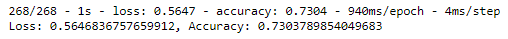

At 73.04% accuracy, our default model appears pretty close to our goal of 75%.

Unfortunately, I was not able to achieve the target accuracy of 75%.  I used a few different approaches to try to increase model performance.  To see how each change worked individually, each attempt worked from the default, not sequentially.  Each optimization model has its own notebook and H5 files in the repository.

#### Individual Changes

##### Model A: Binning Income

This was the change I was most hopeful would produce an improved model.  When examining the INCOME_AMT column for the different organizations, I noticed that there was a huge concentration of zeroes. 

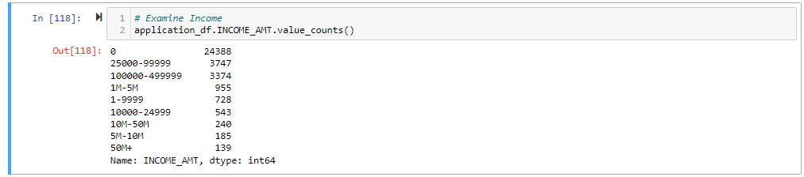

The large majority of incomes were below $100,000, but the data also contained entries with incomes in the tens of millions of dollars.  The zeroes numbered over 24,000, and there were several classes with less than 1,000 instances.  Because these classes were not specifcally the high-income classes but rather were spread between the data, I binned them in neighboring sets of two.

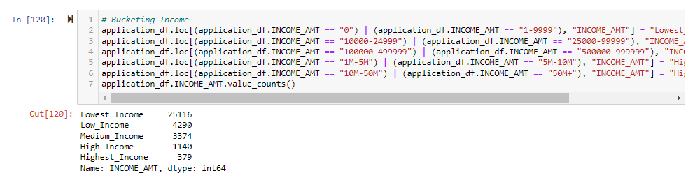

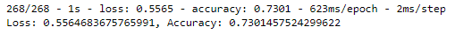

With slightly improved test loss and negligble decrease in accuracy, this model seemed a little bit better than the default.

##### Model B: Using a Tanh Activation Function

In this attempt, I instead replaced the second hidden layer's ReLU activation function with the tanh activation function.  This was mostly trial and error, but I hoped that its ability to output negatives would provide some use to the model.

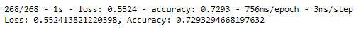

This model lowered both loss and accuracy slightly from the default results.  The changed activation function does not appear to have a large effect.

##### Model C: Adding Neurons to Second Hidden Layer

In this attempt, I added neurons to the second hidden ReLU layer, bringing it from 30 to 50 neurons.  This seemed like a very straightforward way to increase accuracy.

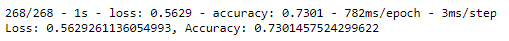

These results are almost identical to the original results.  The accuracy is actually identical to Model A, but with slightly worse test loss.  There does not seem to be a benefit from the additional twenty neurons in the second layer.

##### Model D: Adding Another Hidden Layer

The other most straightforward approach to increasing accuracy is adding another hidden layer.  For this attempt, I added a third hidden ReLU layer with fifteen neurons.

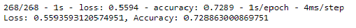

With slightly worse accuracy than the default, it appears that adding another layer could slightly overfit the model to the training data.

#### Combinations of Changes

Unfortunately, none of these four changes enacted individually produced a significantly better model.  I really believed in the logic behind the income binning, so I decided to try a couple more times by combining it with some of the other attempted changes.

##### Model AC

This model combined income binning with twenty additional neurons in the second hidden layer.

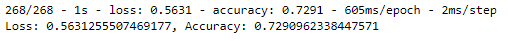

Again, the resulting model was slightly less accurate than both our original results and Model A.  It appears that even after binning income, the additional neurons don't assist the model and instead might be slightly overfitting it.

##### Model AD

Similarly, this model used the binned income variable as well as an additional hidden layer with fifteen neurons.

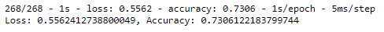

This model actually posted a slightly higher accuracy score!  A difference of 0.002 is basically nothing, but it was nice to see at least one attempt give a better accuracy score, however small the margin, after all of the previous attempts yielded worse accuracy.  Overall though, this model essentially performed the same as the default model but with a slightly better test loss.

##### Model ABD

Since Model AD appeared to be the best of the edited models, I wanted to edit the third activation function to see if any extra interaction could help the model.  As in Model B, I changed the activation function on the last hidden layer to tanh from ReLU.

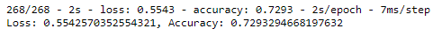

This brought the model back below 73% accuracy, exactly equal to that of Model B.  This suggests that neither binning income nor adding a hidden layer provided any benefit compared to Model B, which was already slightly less accurate than the original.

### Summary

After trying a handful of different options, all of my models essentially sat at an accuracy score of 73%.  None of my attempted optimizations appeared to be helpful, so I elected not to test the remaining combinations of A, B, C, and D.  

With the given input data, the most intuitive approaches of adding neurons or an additional layer were not beneficial, even after binning an irregularly distributed numerical variable such as income.

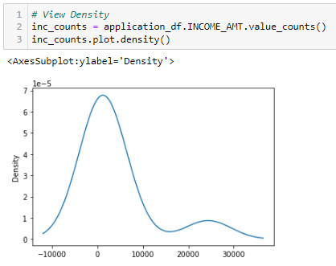

It is a large ask for a model to take in data so concentrated at zero income and to also be able to make predictions for applicants with incomes in the tens of millions.  Instead of bucketing, removal of incomes above one million dollars could potentially provide a better model for the lower incomes.  Higher income applicants could be evaluated in a separate model entirely.  The ask amount variable could be addressed similarly.

Another option would be to build the model using ReLU variants such as Leaky ReLU or Parametrized ReLU.  Our model had 80 neurons in the first hidden layer and 30 in the second, and these variants keep neurons from dying during the training process and could help provide a better effect.  If I were using a stronger computer, I would then also increase the number of epochs to five hundred or one thousand to be more precise.
